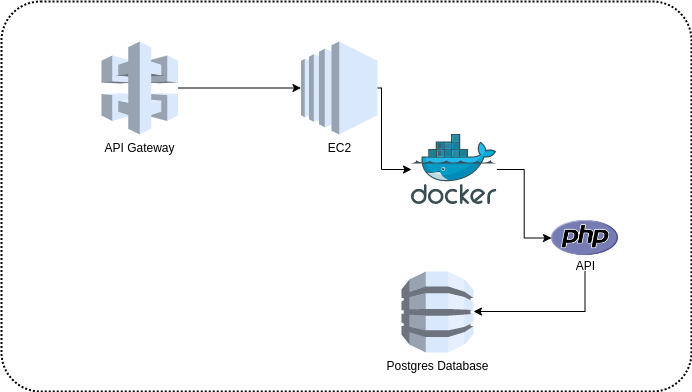

## API Smart IMC

### Arquitetura da solução



### Documentação e API
#### [API](https://kpj3vt8zf2.execute-api.sa-east-1.amazonaws.com) |  [Documentação](https://documenter.getpostman.com/view/5059639/2s8YzZPJxB)


### Comandos para executar o Projeto no ambiente local

#### Buildar e executar
```
cp .env-example .env

docker-compose up -d --build
```

#### Instalar as dependências da aplicação PHP
```
docker exec -it mezzio_api bash

composer install
```

##### Contato
``
jeysonlr@gmail.com | lucasgioricesconetto@gmail.com | phmaia2018@gmail.com
``
